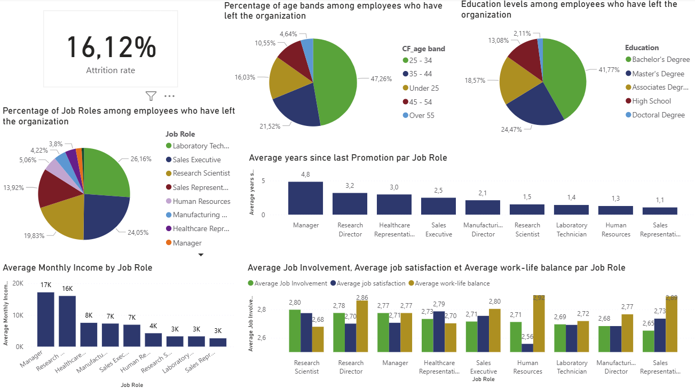

# Employee Attrition Analysis Report

**Report Date:** November 14, 2025

## Executive Summary

This repository contains a comprehensive Power BI report examining employee attrition within an organization. The analysis draws on demographic, compensation, employment, and career-progression data to identify patterns, risk factors, and actionable insights for human resources leadership and organizational planning.

The report is designed for HR professionals, people managers, and organizational leaders seeking to understand workforce retention challenges and to evaluate the effectiveness of retention initiatives.

## Purpose and Scope

Employee attrition represents a significant organizational cost, affecting team continuity, institutional knowledge, and operational efficiency. This analysis aims to:

- Quantify overall attrition rates and trends across the workforce.
- Identify demographic, role-based, and compensation-related patterns in departures.
- Examine the relationship between employee satisfaction, engagement, and attrition.
- Inform evidence-based retention strategies and talent management decisions.

## Repository Contents

- `humain_ressources_dashboard.pbix` — Interactive Power BI report containing dashboards, visuals, and drill-down capabilities.
- `HR Data.xlsx` — Source dataset with employee records (one row per employee) and associated metrics.
- `dashboard.png` — Static preview image of the report dashboard.
- `README.md` — This report documentation.

## Data Overview

The dataset encompasses employee information across five primary dimensions:

### Demographic Profile
- Age, gender, marital status, education level, and education field.
- Custom age banding (`CF_age band`) for cohort analysis.

### Employment Characteristics
- Department, job role, job level, and travel requirements.
- Overtime status, work-life balance perception, and job involvement.
- Environmental, job, and relationship satisfaction ratings.
- Performance ratings.

### Compensation and Benefits
- Monthly, hourly, daily, and monthly rate structures.
- Salary hike percentages and stock option levels.

### Career and Tenure
- Years at the company, years in current role, and years since last promotion.
- Years with current manager and total working experience.
- Number of companies previously worked for.

### Attrition Status
- Binary attrition indicator (current employee vs. departed).
- Classification label (`CF_attrition label`) for reporting purposes.

## Key Performance Indicators

The report tracks the following metrics:

- **Overall Attrition Rate** — Percentage of the workforce classified as departed.
- **Attrition by Job Role** — Distribution of departures across roles to identify high-risk positions.
- **Attrition by Age Band** — Departure patterns across career stages.
- **Attrition by Education Level** — Relationship between educational attainment and retention.
- **Average Years Since Last Promotion (by Role)** — Career progression and advancement timing.
- **Average Monthly Income (by Role)** — Compensation levels across organizational structure.
- **Job Involvement, Satisfaction, and Work-Life Balance (by Role)** — Employee engagement and well-being metrics.

## Report Preview

*The dashboard above provides a visual summary of key metrics and interactive filters for deeper analysis.*

## Key Insights and Recommended Analyses

The report facilitates investigation into the following areas:

### Role and Department Risk Assessment
- Identify which roles and departments experience elevated attrition.
- Prioritize retention efforts in high-impact areas.

### Compensation Analysis
- Compare salary and benefits between retained and departed employees.
- Evaluate whether compensation gaps correlate with departure risk.

### Career Progression
- Examine promotion frequency and tenure patterns.
- Assess whether extended time since promotion predicts attrition.

### Employee Engagement and Satisfaction
- Correlate job satisfaction, work-life balance, and engagement scores with departure rates.
- Identify satisfaction deficits that warrant intervention.

### Tenure Patterns
- Distinguish between early-career churn and late-career departures.
- Evaluate onboarding and integration effectiveness.

## Recommendations for Further Action

- **Data Validation** — Ensure data completeness and consistency before drawing strategic conclusions.
- **Root Cause Analysis** — Augment quantitative analysis with exit interview data and qualitative insights.
- **Cohort Tracking** — Monitor retention rates by hire cohort to assess temporal trends.
- **Program Evaluation** — Develop and measure targeted retention initiatives for identified risk groups.
- **Leadership Alignment** — Communicate findings and recommendations to department heads and executive sponsors.

## Contact

**Repository Maintainer:** Abderrahmane-dotcom

## License

This repository does not currently include an explicit license. For questions regarding data use or reuse rights, please contact the maintainer.

